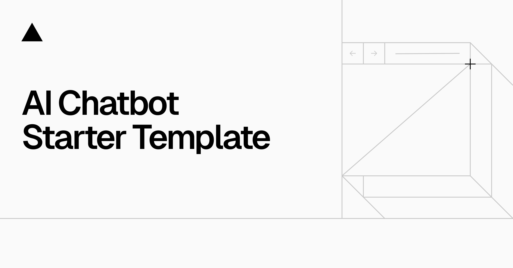

<a href="https://chat.vercel.ai/">
  
  <h1 align="center">Chatbot s AI v Next.js</h1>
</a>
<p align="center">
  Otevřený zdrojový šablonový chatbot s AI postavený pomocí Next.js a AI SDK od Vercel.
</p>
<p align="center">
  <a href="#funkce"><strong>Funkce</strong></a> ·
  <a href="#poskytovatelé-modelů"><strong>Poskytovatelé modelů</strong></a> ·
  <a href="#nasazení-vlastní-verze"><strong>Nasazení vlastní verze</strong></a> ·
  <a href="#spuštění-lokalně"><strong>Spuštění lokalně</strong></a>
</p>
<br/>
## Funkce
- [Next.js](https://nextjs.org) App Router
  - Pokročilé routování pro hladkou navigaci a výkon
  - React Server Components (RSCs) a Server Actions pro serverové vykreslování a zvýšení výkonu
- [AI SDK](https://sdk.vercel.ai/docs)
  - Jednotná API pro generování textu, strukturovaných objektů a volání nástrojů pomocí LLMs
  - Hooky pro vytváření dynamických rozhraní pro chat a generativní uživatelské rozhraní
  - Podporuje OpenAI (výchozí), Anthropic, Cohere a další poskytovatele modelů
- [shadcn/ui](https://ui.shadcn.com)
  - Stylování pomocí [Tailwind CSS](https://tailwindcss.com)
  - Komponentní primitivy z [Radix UI](https://radix-ui.com) pro přístupnost a flexibilitu
- Ukládání dat
  - [Vercel Postgres powered by Neon](https://vercel.com/storage/postgres) pro ukládání historie chatu a uživatelských dat
  - [Vercel Blob](https://vercel.com/storage/blob) pro efektivní úložiště souborů
- [NextAuth.js](https://github.com/nextauthjs/next-auth)
  - Jednoduché a bezpečné ověřování

## Poskytovatelé modelů
Tato šablona obsahuje jako výchozí OpenAI `gpt-4o`. Nicméně pomocí [AI SDK](https://sdk.vercel.ai/docs) můžete snadno změnit poskytovatele LLM na [OpenAI](https://openai.com), [Anthropic](https://anthropic.com), [Cohere](https://cohere.com/) a [mnoho dalších](https://sdk.vercel.ai/providers/ai-sdk-providers) pouze pár řádky kódu.

## Nasazení vlastní verze
Můžete nasadit svou vlastní verzi Chatbotu s AI v Next.js na Vercel jediným kliknutím:
[](https://vercel.com/new/clone?repository-url=https%3A%2F%2Fgithub.com%2Fvercel%2Fai-chatbot&env=AUTH_SECRET,OPENAI_API_KEY&envDescription=Více%20informací%20o%20tom,%20jak%20získat%20API%20klíče%20pro%20aplikaci&envLink=https%3A%2F%2Fgithub.com%2Fvercel%2Fai-chatbot%2Fblob%2Fmain%2F.env.example&demo-title=AI%20Chatbot&demo-description=Otevřený%20zdrojový%20šablonový%20chatbot%20s%20AI%20postavený%20pomocí%20Next.js%20a%20AI%20SDK%20od%20Vercel.&demo-url=https%3A%2F%2Fchat.vercel.ai&stores=[{%22type%22:%22postgres%22},{%22type%22:%22blob%22}])

## Spuštění lokalně
Budete potřebovat proměnné prostředí definované v souboru [.env.example](.env.example) k spuštění Next.js AI Chatbotu. Doporučuje se použít [Proměnné prostředí Vercel](https://vercel.com/docs/projects/environment-variables), ale stačí mít soubor `.env`.

> Poznámka: Nekomitujte svůj soubor `.env`, protože to zveřejní tajné klíče, které umožní ostatním ovládat přístup k vašim účtům OpenAI a ověřování.

1. Nainstalujte Vercel CLI: `npm i -g vercel`
2. Připojte lokální instanci k účtům Vercel a GitHub (vytvoří se složka `.vercel`): `vercel link`
3. Stáhněte si své proměnné prostředí: `vercel env pull`

```bash
pnpm install
pnpm dev
```

Vaše aplikace by teď měla běžet na [localhost:3000](http://localhost:3000/).